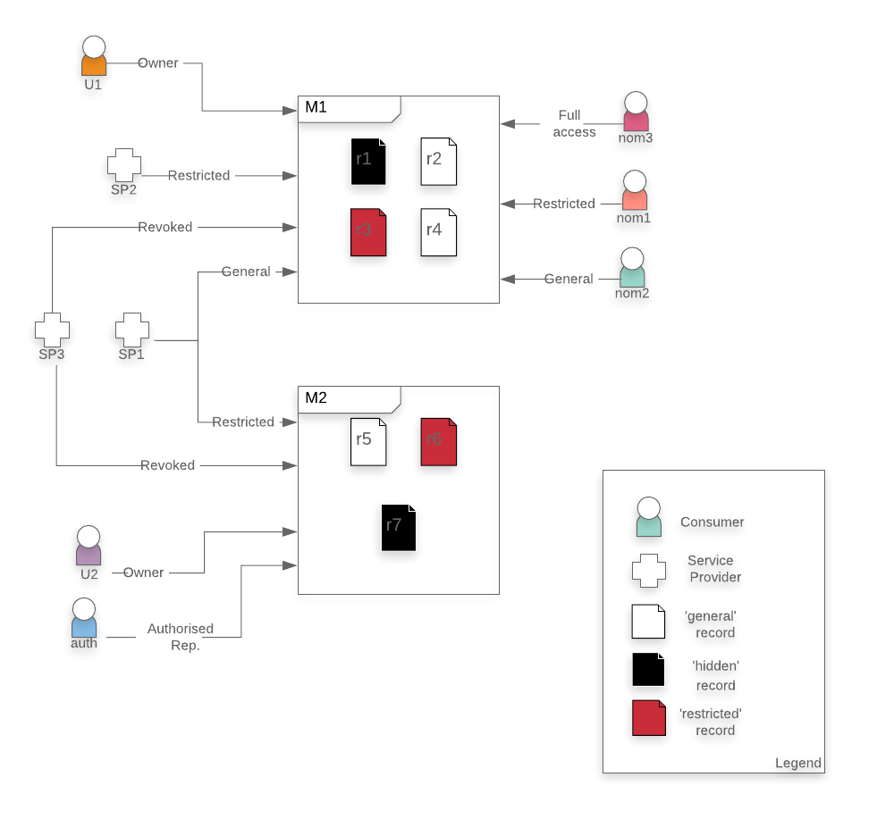

[implementation-tests](implementation-tests.zip) is a Java implementation of the _My Health Records_ system modelled [here](../model/MyHealthRecord-reduced.zip). Java code was automatically generated using the EventB2Java plug-in. JUnit test cases were manually implemented:

All test cases assume the initial state described in the figure below. There are 6 users of the system. __U1__ and _U2_ are two consumers of the system owning My Health Record M1 and M2, respectively. M1 contains 4 records: _r1_ is marked as 'hidden', _r2_ and _r4_ are marked as 'general' and _r3_ is marked as 'restricted'. M1 also has 3 nominated representatives with different access permissions (_nom3_ has Full access, _nom1_ has Restricted access and _nom2_ has General access permissions). M2 has an _auth_orised representative (_auth_) -- _U2_ is a minor. It contains 3 records: _r5_ is marked as 'general', _r6_ as 'restricted' and _r7_ as 'hidden'. The system has 3 service providers (_sp1_, _sp2_ and _sp3_). As shown in the Figure, _sp1_ has General access to M1 and Restricted access to M2, _sp2_ has restricted access to M1, and _sp3_ has Revoked access to both M1 and M2.

Test cases
## Access

---
#### test1
---
**Purpose:** Consumers can access their own records. Except for records marked as 'hidden'.

**Procedure:** Consumer _U1_ tries to access records _r1_, _r2_, _r3_ and _r4_.

**Expected Results:** 
The system allows _U1_ to access records marked as 'general' and 'restricted' (records _r2_, _r3_, _r4_). _U1_ cannot access records marked as 'hidden' (record _r1_).

---
#### test2
---
**Purpose:** Service providers with General permissions can access only records marked as 'general'.

**Procedure:** Service Provider _sp1_ tries to access _U1_'s records.

**Expected Results:** _sp1_ has General access over _U1_'s MyHR. _sp1_ can access records _r2_ and _r4_ as they are marked as 'general'. The system won't let _sp1_ access _r3_ (as it is marked as 'restricted')

---
#### test3
---
**Purpose:** Service providers with Restricted permissions can access records marked as both 'general' and 'restricted'.

**Procedure:** _sp1_ tries to access records _r5_, _r6_ and _r7_, from _U2_'s MyHR. _sp2_ tries to access records _r1_, _r3_ and _r4_, from _U1_'s MyHR.

**Expected Results:** _sp1_ successfully accesses records _r5_ and _r6_ as they are marked as 'general' and 'restricted' and _sp1_ has Restricted access over _U2_'s MyHR. _sp1_, however, fails to access _r7_ as it is marked as 'hidden'. _sp2_ successfully accesses records _r3_ and _r4_ as they are marked as 'general' and 'restricted' and _sp3_ has Restricted access over _U1_'s MyHR. _sp1_, however, fails to access _r1_ as it is marked as 'hidden'.

---
#### test4
---
**Purpose:** Service providers with Revoked permissions cannot access any record. 

**Procedure:** _sp3_ tries to access records _r1_, _r2_, _r3_, _r4_, _r4_, _r6_ and f7.

**Expected Results:** _sp3_ fails to access any record. _sp3_ has Revoked permission over _U1_ and _U2_'s MyHRs.

---
#### test5
---
**Purpose:** Nominated representatives with General permissions have access to records marked as 'general'.

**Procedure:** Nominated Representative _nom2_ tries to access records _r2_, _r4_ and _r3_.

**Expected Results:**  _nom2_ successfully accesses records _r2_ and _r4_. They are marked as 'general' and _nom2_ has General permissions. _nom2_ fails to access _r3_ as it is marked as 'restricted'

---
#### test6
---
**Purpose:** Nominated representatives with Restricted permissions have access to records marked as both 'general' and 'restricted'.

**Procedure:** Nominated Representative _nom1_ tries to access records _r2_, _r4_ and _r3_.

**Expected Results:** _nom1_ successfully accesses all records. _nom1_ has Restricted permissions, thus _nom1_ can access records marked as 'general' and 'restricted'.

---
#### test7
---
**Purpose:** Nominated representatives with Full access permissions have access to records marked as both 'general' and 'restricted'.

**Procedure:** Nominated Representative _nom3_ tries to access records _r2_, _r4_ and _r3_.

**Expected Results:** _nom3_ successfully accesses all records. _nom3_ has Full access permissions, thus _nom3_ can access records marked as 'general' and 'restricted'.

---
#### test8
---
**Purpose:**  _auth_orised representatives can access records marked as 'general' and 'restricted'.

**Procedure:** _auth_orised representative _auth_ tries to access records _r5_ and _r6_.

**Expected Results:** _auth_ has full control over _U2_'s MyHR, hence they can access all records marked as 'general' and 'restricted' (which is the case of _r5_ and _r6_).

---
#### test9
---
**Purpose:** Owners lose access permissions when their My Health Record has at least one _auth_orised representative.

**Procedure:** Consumer _U2_ (owner of M2) tries to access records _r5_ and _r6_.

**Expected Results:** _U2_ fails to do so as the My Health Record has associated at least one _auth_orised representative. Thus, _U2_ loses all permissions over their MyHR

---
#### test10
---
**Purpose:** Records marked as 'hidden' cannot be access by anyone.

**Procedure:** _U1_, _nom1_, _nom2_, _nom3_, _sp1_, _sp2_, _sp3_ try to access hidden record _r1_. _U2_, _auth_, _sp1_ and _sp3_ try to access hidden record _r7_.

**Expected Results:** All tries fail. No one can access hidden records.

## Control

---
#### test11
---
**Purpose:** Owners and can upload records marked as 'general'.

**Procedure:** _U1_ tries to upload a new general record to MyHR M1. _sp1_ tries to access the new record.

**Expected Results:** _U1_ succeeds uploading the new record. _U1_ is the owner of their MyHR and there is not an _auth_orised representative. _sp1_ also succeeds at accessing the new general records as _sp1_ has General permissions.

---
#### test12
---
**Purpose:** Hidden records cannot be deleted.

**Procedure:** _U1_ tries to delete record _r1_.

**Expected Results:** _U1_ fails to do so as _r1_ is marked as 'hidden'.

---
#### test13
---
**Purpose:** It is not possible to access a deleted record.

**Procedure:** _U1_ tries to delete record _r2_. Then, they try to access it.

**Expected Results:** _U1_ succeeds to delete the record. They fail to access it afterwards as the record does not longer exist.

---
#### test14
---
**Purpose:** Owners can upload restricted records to their My Health Record system. 

**Procedure:** _U1_ tries to upload a new restricted record  to MyHR M1. Afterwards, service providers _sp1_ and _sp2_ try to access it.

**Expected Results:** _U1_ successfully uploads the new record and it is marked as 'restricted'. _sp1_ fails to access the record as _sp1_ has General permissions and the new record is marked as 'restricted'. _sp2_ succeeds to access the new record. _sp2_ has Restricted permissions, allowing them to access restricted records

---
#### test15
---
**Purpose:** Owners can delete restricted records.

**Procedure:** _U1_ tries to delete record _r3_. Afterwards, _U1_ tries to delete the same record.

**Expected Results:** _U1_ succeeds to delete record _r3_. Record _r3_ is restricted but _U1_, as owner of the MyHR, has access and control over the record. _U1_ fails to delete again the record as the record does not longer exist.

---
#### test16
---
**Purpose:** Owners can restrict records.

**Procedure:** _sp1_ tries to access _r4_. Then, _U1_, the owner of the record, restrict the access to _r4_. Finally, _sp1_ tries to access again _r4_.

**Expected Results:** _sp1_ has General access over _U1_'s MyHR. Hence, _sp1_ succeeds the first time accessing the record. However, _sp1_ fails the second time as the record is not longer marked as 'general' but as 'restricted' and _sp1_ does not have permissions anymore.

---
#### test17
---
**Purpose:** Owners can mark restricted records as 'general'.

**Procedure:** _sp1_ tries to access record _r3_. Then, _U1_, the owner of the record, marks record _r3_ as 'general'. _sp1_ tries again to access record _r3_.

**Expected Results:**  _sp1_ has General access over _U1_'s MyHR. Hence, _sp1_ cannot access record _r3_ as it is marked as 'restricted'. However, _sp1_ successfully accesses the record once _U1_ has marked it as 'general'

---
#### test18
---
**Purpose:** Owners can hide records.

**Procedure:** _sp2_ tries to access _r3_'s record. Then, _U1_, the owner of the record, hides it. _sp2_ tries again to access _r3_'s record.

**Expected Results:** _sp2_ successfully access record _r3_ as it is marked as 'restricted' but _sp2_'s permissions are 'Restricted' as well. However, once _U1_ hides the record, _sp2_ cannot access it anymore.

---
#### test19
---
**Purpose:** General service providers can access general records.

**Procedure:** _sp1_ tries to upload a new general record  to MyHR M1 . Then, both _sp1_ and _sp2_ try to access it.

**Expected Results:** _sp1_ successfully uploads a general record to M1 as _sp1_ has General permissions over the MyHR. Then, both service providers _sp1_ and _sp2_ successfully access the new record.

---
#### test20
---
**Purpose:** General service providers cannot upload restricted records.

**Procedure:** _sp1_ tries to upload a new restricted record to MyHR M1.

**Expected Results:** _sp1_ fails to do so as _sp1_'s permissions are General.

---
#### test21
---
**Purpose:** Restricted service providers can upload restricted records.

**Procedure:** _sp2_ tries to upload a new restricted record  to MyHR M1. Then, _sp1_ and _U1_, the owner of MyHR M1, tries to access the new record.

**Expected Results:** _sp2_ successfully uploads a new restricted record. _sp2_ has Restricted permissions and it can do so. _U1_ succeeds to access the record. However, _sp1_ fails to do so. _sp1_ has General records and cannot access records marked as 'restricted'

---
#### test22
---
**Purpose:** Revoked service providers cannot upload records.

**Procedure:** _sp3_ tries to upload new general and restricted records  to MyHR M1.

**Expected Results:** _sp3_ fails to upload both general and restricted records. _sp3_ has Revoked permissions and cannot upload records.

---
#### test23
---
**Purpose:** Owners can grant Restricted permissions to nominated representatives.

**Procedure:** Nominated representative _nom2_ tries to access record _r3_. Then, _U1_ grants _nom2_ with Restricted access. Then, _nom2_ tries again to access record _r3_.

**Expected Results:** _nom2_ initially fails to access record _r3_ as it is marked as 'restricted', but _nom2_ has only General access. However, _nom2_ succeeds to access the record once _U1_ has given them Restricted access.

---
#### test24
---
**Purpose:** Owners can downgrade nominated representatives' permissions.

**Procedure:** Nominated representative _nom3_ tries to access _r3_. Then, _U1_, the owner of MyHR M1, downgrades _nom3_ to General permission. Then, _nom3_ tries again to access record _r3_

**Expected Results:** _nom3_ succeeds to access record _r3_ as it is marked as 'Restricted' and _nom3_ has Restricted access. However, _nom3_ fails to access record _r3_ after _U1_ downgrades it to General permissions. General representatives cannot access restricted records.

---
#### test25
---
**Purpose:** Full access nominated representatives can add records. 

**Procedure:** Nominated representative _nom3_ tries to upload a new general record to MyHR M1. Then, nominated representative _nom2_ tries to access it.

**Expected Results:** _nom3_ succeeds to upload the new record marked as 'general'. _nom2_ succeeds to access the new record, as _nom2_ has General permissions.

---
#### test26
---
**Purpose:** Full access nominated representatives can add records.

**Procedure:** Nominated representative _nom3_ tries to upload a new restricted record to MyHR M1. Then, nominated representative _nom2_ tries to access it.

**Expected Results:** _nom3_ succeeds to upload the new record marked as 'restricted'. _nom2_ fails to access the new record, as _nom2_ has General permissions, hence they cannot access 'restricted' content.

---
#### test27
---
**Purpose:** Full access nominated representatives can add records.

**Procedure:** execute test25; _U1_ downgrades nominated representative _nom3_ to Restricted access. Then _nom3_ tries to access record _r3_. Finally, _nom3_ tries to upload a new general record.

**Expected Results:** _U1_ successfully downgrades _nom3_ to Restricted representative. _nom3_ succeeds to access record _r3_ as it is marked as 'restricted'. However, _nom3_ fails to upload a new record as Restricted representatives cannot perform that action.

---
#### test28
---
**Purpose:** Owners lose all control over their My Health Record if there is at least on _auth_orised representative.

**Procedure:** _U2_, owner of MyHR M2, tries to
* access records _r5_ and _r6_
* delete records _r5_ and _r6_
* upload a new general record to M2
* upload a new restricted record to M2
* mark record _r5_ as 'restricted'
* mark record _r6_ as 'general'
* hide record _r5_
* revoke the access of _sp1_ in M2
* upgrade _sp3_ to Restricted service provider in M2
* upgrade _sp3_ to General service provider in M2
* add _nom1_ as a General nominated representative in M2
* add _nom2_ as a Full access nominated representative in M2

**Expected Results:** _U2_ fails to perform all actions. _U2_ is the owner of M2. M2 has a _auth_orised representative. Hence, _U2_ loses all control and access over M2.

---
#### test29
---
**Purpose:** _auth_orised representatives act as owners.

**Procedure:** _auth_orised representative _auth_ tries to
* access records _r5_ and _r6_
* delete records _r5_ and _r6_
* upload a new general record to M2
* upload a new restricted record to M2
* mark record _r5_ as 'restricted'
* mark record _r6_ as 'general'
* hide record _r5_
* revoke the access of _sp1_ in M2
* upgrade _sp3_ to Restricted service provider in M2
* upgrade _sp3_ to General service provider in M2
* add _nom1_ as a General nominated representative in M2
* add _nom2_ as a Full access nominated representative in M2

**Expected Results:** _auth_ succeeds to perform all actions. _auth_ has full control over M2.

---
#### test30
---
**Purpose:** _auth_orised representatives can add the consumer they are representing to a service provider.

**Procedure:** _auth_orised representative _auth_ add _U2_ to service provider _sp3_. Then, _auth_ give Restricted permissions to _sp3_. Finally, _sp3_ tries to access record _r6_.

**Expected Results:** _auth_ succeeds to add _U2_ to _sp3_. _auth_ also succeeds to give them Restricted permissions. Once _sp3_ has Restricted permission over M2, _sp3_ can access record _r6_ that is marked as 'restricted'.